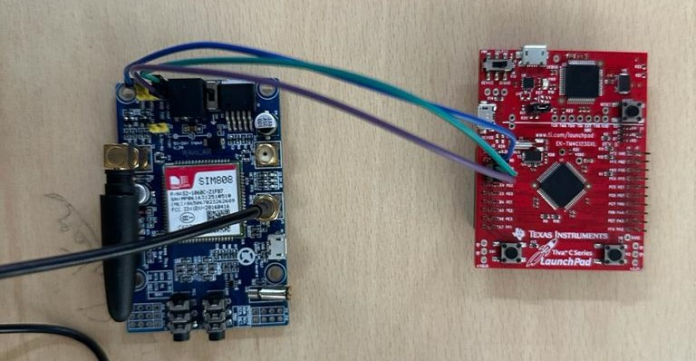

# GPS Tracking System with TM4C123GH6PM TivaC Launchpad and SIM808

## Overview

This repository contains code for a GPS tracking system using TM4C123GH6PM TivaC Launchpad and SIM808. It leverages GNSS for location tracking and sends coordinates to an AWS server via HTTP GET requests.

## Demo

https://youtu.be/42goQ_c1EHM

## Structure

### 1. [Server Code](/server)
   - Manages HTTP requests on the AWS server.
   - Follow setup instructions in `/server` for configuration.

### 2. [Tiva C Code](/tiva_c)
   - Communicates with SIM808 via UART1 to capture GNSS data and send requests to server over GPRS.
   - See `/tiva_c` for hardware setup and configuration.

